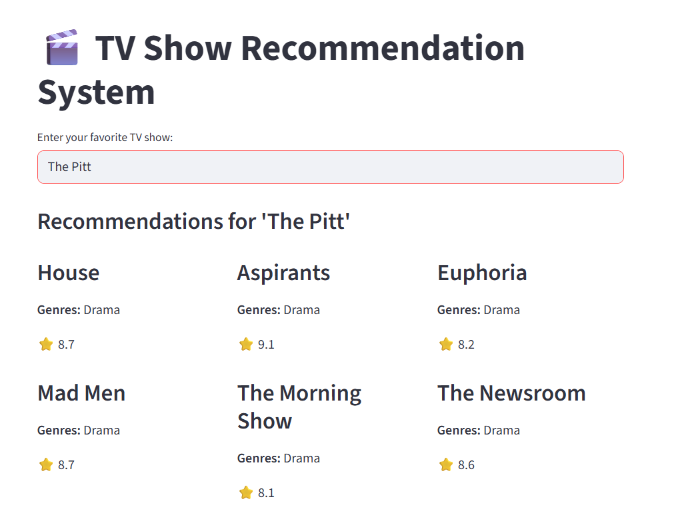

**📺 TV Show Recommendation Algorithm **[Streamlit App URL](https://tv-show-recommendation-algorithm.streamlit.app/)**

**Overview**
- This project implements a recommendation system for TV shows using machine learning techniques. The goal is to suggest shows tailored to user preferences based on ratings, genres, and viewing history.

**Features**
- Data preprocessing: Cleaning and structuring raw datasets.
- Exploratory Data Analysis (EDA): Visualizing trends in genres, ratings, and popularity.
- Recommendation approaches:
-   Content-based filtering (similarity by genres, descriptions).
-   Collaborative filtering (user–item interactions).
- Evaluation metrics: Precision, recall, RMSE for model performance.
- Interactive Jupyter Notebook: Step-by-step workflow with explanations
  
**Tech Stack**
- Languages: Python
- Libraries: Pandas, NumPy, Scikit-learn, Matplotlib, Seaborn
- Tools: Jupyter Notebook, GitHub
  
**Dataset**
- Source: https://datasets.imdbws.com/
- Key attributes: Title, Genre, Rating, User reviews
  
**Results**
- Generated personalized recommendations with high relevance.
- Visualized genre popularity trends and user behavior.

**📺Streamlit App**

**In addition to the Jupyter Notebook workflow, Streamlit web application for interactive recommendations is also available via url in the first line.**

**Features**
- User-friendly interface where visitors can type in their favorite TV show.
- Generates personalized recommendations using content-based filtering (genre similarity).
- Displays results in a grid layout with show titles, genres, and ratings.
- Easy to deploy and share via a public Streamlit URL.

## 📸 Preview
Here’s a screenshot of the app in action:

